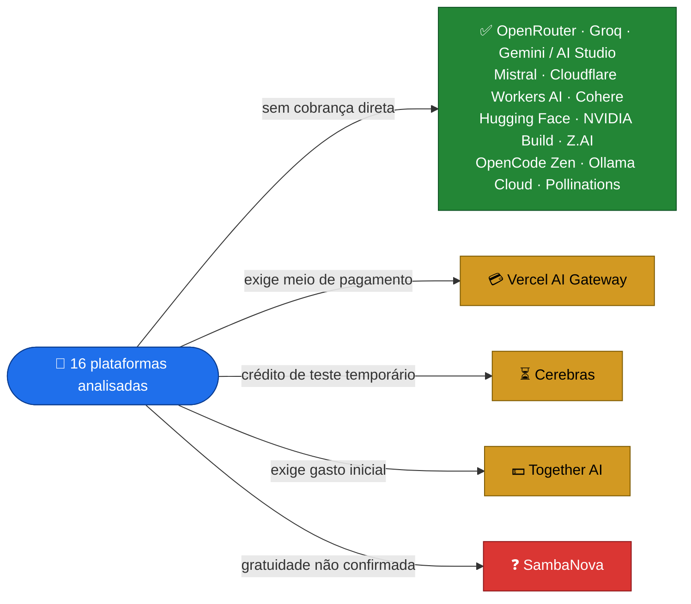

# 🤖 APIs de IA gratuitas para desenvolvimento

Levantamento de plataformas, provedores e modelos de Inteligência Artificial com API gratuita, franquia gratuita ou créditos de avaliação.

> Levantamento realizado em **04 de outubro de 2026**.
>
> Mantido pela **[Allsafe](https://allsafe.inf.br/)** · [github.com/allsafe-inf](https://github.com/allsafe-inf)



Legenda: 🟦 ponto de partida · 🟩 acesso sem cobrança direta · 🟨 gratuito com condição · 🟥 gratuidade não confirmada.

<details>
<summary>📑 Sumário</summary>

- [🎯 Sobre o levantamento](#-sobre-o-levantamento)
- [⭐ Objetivo do projeto](#-objetivo-do-projeto)
- [🏆 Resumo das plataformas](#-resumo-das-plataformas)
- [🏷️ Classificação por tipo de gratuidade](#️-classificação-por-tipo-de-gratuidade)
- [🔀 1. OpenRouter](#-1-openrouter)
- [⚡ 2. Groq](#-2-groq)
- [🧠 3. Google Gemini / AI Studio](#-3-google-gemini--ai-studio)
- [🌪️ 4. Mistral AI](#️-4-mistral-ai)
- [☁️ 5. Cloudflare Workers AI](#️-5-cloudflare-workers-ai)
- [🟢 6. Cohere](#-6-cohere)
- [🤗 7. Hugging Face — Inference Providers](#-7-hugging-face--inference-providers)
- [🧮 8. Cerebras](#-8-cerebras)
- [🟩 9. NVIDIA Build](#-9-nvidia-build)
- [🆕 Outras APIs e plataformas encontradas](#-outras-apis-e-plataformas-encontradas)
- [🧠 10. Z.AI](#-10-zai)
- [🧩 11. OpenCode Zen](#-11-opencode-zen)
- [🦙 12. Ollama Cloud](#-12-ollama-cloud)
- [▲ 13. Vercel AI Gateway](#-13-vercel-ai-gateway)
- [🌸 14. Pollinations](#-14-pollinations)
- [⚠️ 15. Together AI — caso especial](#️-15-together-ai--caso-especial)
- [⚠️ 16. SambaNova — gratuidade não confirmada](#️-16-sambanova--gratuidade-não-confirmada)
- [⚠️ Observações importantes](#️-observações-importantes)
- [💻 Aplicações](#-aplicações)
- [🔄 Estratégia com múltiplos provedores](#-estratégia-com-múltiplos-provedores)
- [🔎 Como estas plataformas foram encontradas](#-como-estas-plataformas-foram-encontradas)
- [📚 Referências utilizadas na pesquisa](#-referências-utilizadas-na-pesquisa)
- [👥 Autoria e créditos](#-autoria-e-créditos)
- [📌 Data das informações](#-data-das-informações)
- [🤝 Contribuições](#-contribuições)
- [⚖️ Aviso](#️-aviso)

</details>

---

## 🎯 Sobre o levantamento

Este documento reúne plataformas, provedores e modelos de Inteligência Artificial que oferecem, no momento do levantamento, algum tipo de:

- API gratuita;
- endpoint gratuito;
- franquia mensal gratuita;
- cota diária gratuita;
- créditos de avaliação;
- acesso gratuito voltado a desenvolvimento, testes ou prototipagem.

O objetivo principal deste levantamento é encontrar alternativas para uso com:

- Claude Code;
- Codex;
- agentes de programação;
- automações;
- aplicações próprias;
- ferramentas internas;
- testes de modelos;
- APIs compatíveis com aplicações de desenvolvimento.

> [!IMPORTANT]
> Os limites, modelos disponíveis, preços e políticas podem mudar a qualquer momento.
>
> Sempre consulte a documentação oficial e o painel da sua conta antes de utilizar qualquer serviço em produção.

> [!NOTE]
> Podem existir outros provedores ou modelos gratuitos que não foram encontrados durante este levantamento.

---

## ⭐ Objetivo do projeto

Criar e manter uma referência atualizada de APIs e modelos de Inteligência Artificial que possam ser utilizados gratuitamente ou com alguma franquia gratuita para:

```text
Desenvolvimento
Programação
Automação
Infraestrutura
DevOps
Agentes
Testes
Prototipagem
Pesquisa
```

---

## 🏆 Resumo das plataformas

| # | Plataforma | Tipo de acesso gratuito | Limite / Crédito | Observação |
|---:|---|---|---|---|
| 1 | **OpenRouter** | Modelos `:free` | US$ 0/0 por 1M nos modelos `:free` | Muitos modelos em uma única API |
| 2 | **Groq** | Cota diária | Por modelo (ver tabela) | Inferência extremamente rápida |
| 3 | **Gemini / AI Studio** | Cotas por projeto | Consultar AI Studio | Ecossistema Google |
| 4 | **Mistral** | Franquia gratuita | Consultar painel | Modelos próprios |
| 5 | **Cloudflare Workers AI** | Franquia diária compartilhada | **10.000 neurons/dia** | Integração com Cloudflare |
| 6 | **Cohere** | Chave gratuita de avaliação | **1.000 chamadas/mês** | Command, Embed e Rerank |
| 7 | **Hugging Face** | Créditos mensais | **US$ 0,10/mês** | Diversos provedores |
| 8 | **Cerebras** | Crédito de teste | **US$ 5 / 30 dias** | Teste temporário e alta velocidade |
| 9 | **NVIDIA Build** | Free Endpoints | Quantidade não publicada | Grande variedade de modelos |
| 10 | **Z.AI** | Modelos específicos gratuitos | Quantidade não publicada | GLM Flash gratuitos |
| 11 | **OpenCode Zen** | Endpoints gratuitos | Quantidade não publicada | Promoções temporárias |
| 12 | **Ollama Cloud** | Franquia mensal gratuita | Não publicado | 1 requisição simultânea |
| 13 | **Vercel AI Gateway** | Crédito mensal | **US$ 5/mês** | Exige meio de pagamento |
| 14 | **Pollinations** | Créditos Pollen | Conforme tarefas | Não possui franquia fixa confirmada |
| 15 | **Together AI** | Modelo específico US$ 0/token | — | Exige compra inicial de US$ 5 |
| 16 | **SambaNova** | Possível tier gratuito | 200k tokens/dia/modelo na documentação | Informações oficiais divergentes |

---

## 🏷️ Classificação por tipo de gratuidade

### ✅ Pode possuir acesso sem cobrança direta

```text
OpenRouter
Groq
Google Gemini / AI Studio
Mistral AI
Cloudflare Workers AI
Cohere
Hugging Face
NVIDIA Build
Z.AI
OpenCode Zen
Ollama Cloud
Pollinations
```

### 💳 Gratuito, mas exige meio de pagamento

```text
Vercel AI Gateway
```

### ⏳ Crédito de teste temporário, com meio de pagamento

```text
Cerebras
```

### 💵 Modelo gratuito, mas exige gasto inicial

```text
Together AI
```

### ❓ Gratuidade não confirmada para novas contas

```text
SambaNova
```

---

## 🔀 1. OpenRouter

🌐 https://openrouter.ai/

O OpenRouter disponibiliza vários modelos gratuitos através de uma API centralizada.

### Modelos gratuitos encontrados

| Empresa | Modelo | ID da API | Contexto | Tools | Preço |
|---|---|---|---:|:---:|---:|
| Apodex | Apodex 1.1 Mini | `apodex/apodex-1.1-mini:free` | 262k | ✅ | US$ 0/0 por 1M |
| Cohere | North Mini Code | `cohere/north-mini-code:free` | 256k | ✅ | US$ 0/0 por 1M |
| Dots Studio | Dots3-Note Preview | `dots-studio/dots-3-note-preview:free` | 512k | ✅ | US$ 0/0 por 1M |
| Google | Gemma 4 26B A4B | `google/gemma-4-26b-a4b-it:free` | 262k | ✅ | US$ 0/0 por 1M |
| Google | Gemma 4 31B | `google/gemma-4-31b-it:free` | 262k | ✅ | US$ 0/0 por 1M |
| inclusionAI | Ling 3.0 Flash Sante | `inclusionai/ling-3.0-flash-sante:free` | 262k | ✅ | US$ 0/0 por 1M |
| LiquidAI | LFM2.5-2.6B | `liquid/lfm-2.5-2.6b:free` | 66k | ✅ | US$ 0/0 por 1M |
| NVIDIA | Nemotron 3 Nano Omni | `nvidia/nemotron-3-nano-omni-30b-a3b-reasoning:free` | 256k | ✅ | US$ 0/0 por 1M |
| NVIDIA | Nemotron 3 Super | `nvidia/nemotron-3-super-120b-a12b:free` | 262k | ✅ | US$ 0/0 por 1M |
| NVIDIA | Nemotron 3 Ultra | `nvidia/nemotron-3-ultra-550b-a55b:free` | 1M | ✅ | US$ 0/0 por 1M |
| NVIDIA | Nemotron 3.5 Lightning | `nvidia/nemotron-3.5-lightning:free` | 1M | ✅ | US$ 0/0 por 1M |
| Poolside | Laguna S 2.1 | `poolside/laguna-s-2.1:free` | 262k | ✅ | US$ 0/0 por 1M |
| Poolside | Laguna XS 2.1 | `poolside/laguna-xs-2.1:free` | 262k | ✅ | US$ 0/0 por 1M |
| Qwen | Qwen3.8 27B | `qwen/qwen3.8-27b:free` | 262k | ✅ | US$ 0/0 por 1M |
| Thinking Machines | Inkling Small | `thinkingmachines/inkling-small:free` | 1M | ✅ | US$ 0/0 por 1M |
| Thinking Machines | Inkling | `thinkingmachines/inkling:free` | 1M | ✅ | US$ 0/0 por 1M |
| NVIDIA | Nemotron 3.5 Content Safety | `nvidia/nemotron-3.5-content-safety:free` | 128k | ❌ | US$ 0/0 por 1M |

> O sufixo `:free` identifica as variantes gratuitas encontradas durante o levantamento.

---

## ⚡ 2. Groq

📚 Documentação:

https://console.groq.com/docs/rate-limits

O Groq disponibiliza vários modelos através de uma cota gratuita.

Os limites são aplicados por modelo e pela organização.

### Limites encontrados

| Modelo | Crédito gratuito | Tokens/minuto | Tokens/dia | Chamadas/minuto | Chamadas/dia |
|---|---|---:|---:|---:|---:|
| GPT-OSS 120B | Cota gratuita | 8.000 | 200.000 | 30 | 1.000 |
| GPT-OSS 20B | Cota gratuita | 8.000 | 200.000 | 30 | 1.000 |
| GPT-OSS Safeguard 20B | Cota gratuita | 8.000 | 200.000 | 30 | 1.000 |
| Qwen 3.8 27B | Cota gratuita | 8.000 | 200.000 | 30 | 1.000 |
| Llama Prompt Guard 2 22M | Cota gratuita | 15.000 | 500.000 | 30 | 14.400 |
| Llama Prompt Guard 2 86M | Cota gratuita | 15.000 | 500.000 | 30 | 14.400 |
| Orpheus Arabic Saudi | Cota gratuita | 1.200 | 3.600 | 10 | 100 |
| Orpheus English | Cota gratuita | 1.200 | 3.600 | 10 | 100 |
| Whisper Large V3 | Cota gratuita | Por áudio | 8 horas de áudio/dia | 20 | 2.000 |
| Whisper Large V3 Turbo | Cota gratuita | Por áudio | 8 horas de áudio/dia | 20 | 2.000 |

### Observações

- Prompt Guard e Safeguard são modelos de segurança.
- Whisper é utilizado para transcrição de áudio.
- Orpheus é utilizado para geração de voz.
- Os limites reais da conta devem ser confirmados no painel.

---

## 🧠 3. Google Gemini / AI Studio

📚 Preços e documentação:

https://ai.google.dev/gemini-api/docs/pricing?hl=pt-br

O Google disponibiliza diversos modelos com utilização gratuita através do Gemini API / AI Studio.

A gratuidade funciona através de uma **cota de utilização**, não de um saldo fixo em dólares.

### Modelos identificados com cota gratuita

<details>
<summary>🧠 Exibir os 25 modelos e famílias do Gemini com cota gratuita</summary>

| Modelos / Família | Crédito gratuito | Limite |
|---|---|---|
| Gemini 3.8 Flash | Cota gratuita | Consultar AI Studio |
| Gemini 3.7 Flash | Cota gratuita | Consultar AI Studio |
| Gemini 3.6 Flash | Cota gratuita | Consultar AI Studio |
| Gemini 3.5 Flash | Cota gratuita | Consultar AI Studio |
| Gemini 3.5 Flash-Lite | Cota gratuita | Consultar AI Studio |
| Gemini 3.1 Flash-Lite | Cota gratuita | Consultar AI Studio |
| Gemini 3 Flash Preview | Cota gratuita | Consultar AI Studio |
| Gemini 2.5 Pro | Cota gratuita | Consultar AI Studio |
| Gemini 2.5 Flash | Cota gratuita | Consultar AI Studio |
| Gemini 2.5 Flash-Lite | Cota gratuita | Consultar AI Studio |
| Gemini 3.8 Live | Cota gratuita | Consultar AI Studio |
| Gemini 3.8 Live Extended Thinking | Cota gratuita | Consultar AI Studio |
| Gemini 3.1 Flash Live Preview | Cota gratuita | Consultar AI Studio |
| Gemini 2.5 Flash Native Audio | Cota gratuita | Consultar AI Studio |
| Gemini 3.5 Live Translate | Cota gratuita | Consultar AI Studio |
| Gemini 3.5 Transcribe Live | Cota gratuita | Consultar AI Studio |
| Gemini 3.5 Transcribe | Cota gratuita | Consultar AI Studio |
| Gemini 3.8 Flash TTS | Cota gratuita | Consultar AI Studio |
| Gemini 3.8 Flash-Lite TTS | Cota gratuita | Consultar AI Studio |
| Gemini 3.1 Flash TTS Preview | Cota gratuita | Consultar AI Studio |
| Gemini 2.5 Flash Preview TTS | Cota gratuita | Consultar AI Studio |
| Gemini Embedding 2 | Cota gratuita | Consultar AI Studio |
| Gemini Robotics ER 2 Preview | Cota gratuita | Consultar AI Studio |
| Gemini Robotics Streaming Preview | Cota gratuita | Consultar AI Studio |
| Gemma 4 — variantes disponíveis na API | Cota gratuita | Consultar AI Studio |

</details>

### Limites

Os limites são normalmente aplicados por projeto e podem variar de acordo com:

- modelo;
- projeto;
- região;
- conta;
- disponibilidade;
- tier.

Podem existir limites de:

- RPM — Requests Per Minute;
- RPD — Requests Per Day;
- TPM — Tokens Per Minute.

> As cotas são associadas ao projeto e não simplesmente à chave de API.

---

## 🌪️ 4. Mistral AI

📚 Documentação:

https://docs.mistral.ai/admin/billing-usage/usage-limits

A Mistral disponibiliza um modo gratuito para desenvolvimento e avaliação.

A quantidade exata de utilização disponível deve ser consultada diretamente no painel da organização.

### Exemplos

| Modelo | Crédito / cota gratuita | Tokens gratuitos | Chamadas |
|---|---|---|---|
| `mistral-small-latest` | Franquia mensal do modo gratuito | Consultar painel | Consultar painel |
| `mistral-large-latest` | Franquia mensal do modo gratuito | Consultar painel | Consultar painel |
| Outros modelos habilitados | Conforme disponibilidade | Consultar painel | Consultar painel |

> Não foi possível confirmar publicamente uma lista universal de todos os modelos liberados gratuitamente para todas as contas.

---

## ☁️ 5. Cloudflare Workers AI

📚 Preços:

https://developers.cloudflare.com/workers-ai/platform/pricing/

O Cloudflare Workers AI disponibiliza uma franquia gratuita baseada em **neurons**.

### Franquia

```text
10.000 neurons por dia
```

Esse saldo é compartilhado entre os modelos utilizados.

> [!WARNING]
> Não são 10.000 neurons por modelo.
>
> Existe um único saldo diário compartilhado.

### Estimativa de tokens por modelo

As estimativas abaixo consideram uso integral dos 10.000 neurons em apenas um modelo, aproximadamente com quantidades equivalentes de entrada e saída e sem considerar cache.

<details>
<summary>☁️ Exibir a estimativa de tokens por modelo (26 modelos)</summary>

| Modelo | Neurons gratuitos/dia | Tokens totais estimados/dia |
|---|---:|---:|
| Llama 3.2 1B Instruct | 10.000 | ≈ 965 mil |
| Llama 3.2 3B Instruct | 10.000 | ≈ 569 mil |
| Llama 3.1 8B FP8 Fast | 10.000 | ≈ 512 mil |
| Llama 3.2 11B Vision | 10.000 | ≈ 303 mil |
| Llama 3.1 70B / Llama 3.3 70B FP8 Fast | 10.000 | ≈ 86 mil |
| DeepSeek R1 Distill Qwen 32B | 10.000 | ≈ 40 mil |
| Mistral 7B Instruct | 10.000 | ≈ 732 mil |
| Mistral Small 3.1 24B | 10.000 | ≈ 242 mil |
| Llama 3.1 8B / Llama 3 8B Instruct | 10.000 | ≈ 198 mil |
| Llama 3.1 8B FP8 | 10.000 | ≈ 501 mil |
| Llama 3.1 8B / Llama 3 8B AWQ | 10.000 | ≈ 565 mil |
| Llama 2 7B Chat FP16 | 10.000 | ≈ 30 mil |
| Llama Guard 3 8B | 10.000 | ≈ 427 mil |
| Llama 4 Scout 17B 16E | 10.000 | ≈ 196 mil |
| Gemma 3 12B | 10.000 | ≈ 244 mil |
| QwQ 32B / Qwen 2.5 Coder 32B | 10.000 | ≈ 132 mil |
| Qwen 3 30B A3B FP8 | 10.000 | ≈ 569 mil |
| Qwen 3.8 27B | 10.000 | ≈ 60 mil |
| GPT-OSS 120B | 10.000 | ≈ 200 mil |
| GPT-OSS 20B | 10.000 | ≈ 439 mil |
| Gemma SEA-LION V4 27B | 10.000 | ≈ 242 mil |
| Granite 4.0 H Micro | 10.000 | ≈ 1,71 milhão |
| GLM 4.7 Flash | 10.000 | ≈ 477 mil |
| Nemotron 3 120B A12B | 10.000 | ≈ 109 mil |
| Kimi K2.5 | 10.000 | ≈ 61 mil |
| Gemma 4 26B A4B | 10.000 | ≈ 549 mil |

</details>

### Outros tipos de modelo disponíveis

<details>
<summary>☁️ Exibir embeddings, imagens, áudio, voz, tradução e visão</summary>

| Categoria | Modelos | Cota |
|---|---|---|
| Embeddings | BGE Small, Base, Large e M3 | Mesmo saldo |
| Embeddings | PLaMo Embedding 1B | Mesmo saldo |
| Embeddings | Qwen3 Embedding 0.6B | Mesmo saldo |
| Imagens | FLUX.1 Schnell | Mesmo saldo |
| Imagens | FLUX.2 Dev | Mesmo saldo |
| Imagens | FLUX.2 Klein 4B/9B | Mesmo saldo |
| Imagens | Lucid Origin | Mesmo saldo |
| Imagens | Phoenix 1.0 | Mesmo saldo |
| Áudio | Whisper | Mesmo saldo |
| Áudio | Whisper Large V3 Turbo | Mesmo saldo |
| Voz | MeloTTS | Mesmo saldo |
| Voz | Deepgram Aura 1/2 | Mesmo saldo |
| Voz | Nova 3 | Mesmo saldo |
| Voz | Flux | Mesmo saldo |
| Voz | Smart Turn V2 | Mesmo saldo |
| Classificação | DistilBERT SST-2 | Mesmo saldo |
| Reranking | BGE Reranker | Mesmo saldo |
| Tradução | M2M100 | Mesmo saldo |
| Tradução | IndicTrans2 | Mesmo saldo |
| Visão | ResNet-50 | Mesmo saldo |
| Visão | Moondream 3.1 | Mesmo saldo |
| Outros | CLEF | Mesmo saldo |
| Outros | CLEF Flash | Mesmo saldo |

</details>

### Modelos identificados como pagos

Alguns endpoints e modelos específicos exigem pagamento, incluindo:

- Kimi K2.6/K2.7 Code;
- GLM 5.2;
- GLM 5.3;
- GLM 5.3 Flash;
- determinados endpoints DeepSeek V4 Flash;
- determinados endpoints DeepSeek V4 Pro.

---

## 🟢 6. Cohere

📚 Documentação:

https://docs.cohere.com/v1/docs/rate-limits

A chave gratuita de avaliação da Cohere oferece aproximadamente:

```text
1.000 chamadas por mês
```

Esse limite é compartilhado entre os serviços.

### Modelos e serviços

| Modelo / Serviço | Cota gratuita mensal | Tokens gratuitos | Limite por minuto |
|---|---:|---|---:|
| Command A+ | Mesmo saldo de 1.000 chamadas | Não informado | 20 |
| Command A | Mesmo saldo | Não informado | 20 |
| Command A Reasoning | Mesmo saldo | Não informado | 20 |
| Command A Translate | Mesmo saldo | Não informado | 20 |
| Command A Vision | Mesmo saldo | Não informado | 20 |
| Command R+ | Mesmo saldo | Não informado | 20 |
| Command R | Mesmo saldo | Não informado | 20 |
| Command R7B | Mesmo saldo | Não informado | 20 |
| North Mini Code | Mesmo saldo | Não informado | 20 |
| Embed — texto | Mesmo saldo | Não informado | 2.000 entradas |
| Embed — imagens | Mesmo saldo | Por imagens | 5 entradas |
| Rerank | Mesmo saldo | Não informado | 10 |

> O acesso gratuito é voltado principalmente para avaliação, testes e protótipos.

---

## 🤗 7. Hugging Face — Inference Providers

📚 Documentação:

https://huggingface.co/docs/inference-providers/pricing

Contas gratuitas recebem aproximadamente:

```text
US$ 0,10 em créditos por mês
```

O valor é compartilhado entre os provedores e modelos compatíveis.

Não existe uma quantidade fixa universal de tokens.

### Exemplos de modelos disponíveis através dos provedores

<details>
<summary>🤗 Exibir os 16 exemplos de modelos</summary>

| Modelo / Família | Crédito gratuito mensal | Tokens gratuitos |
|---|---:|---|
| GPT-OSS 120B | US$ 0,10 compartilhado | Conforme preço do provedor |
| GPT-OSS 20B | Mesmo saldo | Conforme preço |
| Llama 3.1 8B Instruct | Mesmo saldo | Conforme preço |
| Llama 3.2 1B | Mesmo saldo | Conforme preço |
| Llama 3.2 3B Instruct | Mesmo saldo | Conforme preço |
| Llama 3.3 70B Instruct | Mesmo saldo | Conforme preço |
| Qwen3 0.6B | Mesmo saldo | Conforme preço |
| Qwen3 8B | Mesmo saldo | Conforme preço |
| Qwen 3.8 2.4T A95B | Mesmo saldo | Conforme preço |
| DeepSeek R1 | Mesmo saldo | Conforme preço |
| DeepSeek V4 Pro | Mesmo saldo | Conforme preço |
| DeepSeek V4 Flash | Mesmo saldo | Conforme preço |
| GLM 5.3 | Mesmo saldo | Conforme preço |
| MiMo V2.6 Pro RL | Mesmo saldo | Conforme preço |
| MiMo V2.6 Flash RL | Mesmo saldo | Conforme preço |
| Gemma 2 2B IT | Mesmo saldo | Conforme preço |

</details>

### Observações

A disponibilidade varia por provedor.

Os créditos gratuitos são utilizados quando as chamadas são roteadas através dos **Inference Providers do Hugging Face**.

Caso seja utilizada uma chave própria de outro fornecedor, a cobrança seguirá as condições daquele fornecedor.

---

## 🧮 8. Cerebras

📚 Limites:

https://inference-docs.cerebras.ai/support/rate-limits

A Cerebras foi identificada no levantamento como oferecendo principalmente um **teste temporário**, e não uma franquia gratuita recorrente.

### Crédito de teste

```text
US$ 5 por 30 dias
```

É necessário cadastrar um meio de pagamento verificado.

### Limites identificados

| Modelo | Crédito | Tokens/minuto sem cache | Tokens/minuto total | Tokens/dia | Chamadas/minuto |
|---|---|---:|---:|---:|---:|
| GPT-OSS 120B | US$ 5 compartilhados | 30.000 | 90.000 | 1 milhão | 5 |
| Qwen 3.8 27B | Mesmo saldo | 30.000 | 90.000 | 1 milhão | 5 |

> Não foi identificada uma cota gratuita recorrente equivalente às opções anteriores.

---

## 🟩 9. NVIDIA Build

No levantamento realizado em **04/10/2026**, a NVIDIA Build apresentava aproximadamente **38 modelos ou serviços com indicação de `Free Endpoint`**.

Foram incluídos modelos da própria NVIDIA e de outras empresas hospedados na infraestrutura NVIDIA.

> 🙌 As APIs gratuitas da NVIDIA Build foram indicadas por [Gilson Mendes](https://github.com/GilsonMendes).

> [!IMPORTANT]
> A NVIDIA não apresentou uma quantidade pública fixa e universal de tokens gratuitos para todos esses endpoints.
>
> Os limites podem variar conforme:
>
> - modelo;
> - demanda;
> - conta;
> - região;
> - disponibilidade.

O limite aplicável deve ser consultado diretamente na conta.

### 💬 Conversa, programação e raciocínio

| Modelo |
|---|
| `deepseek-v4.1-flash` |
| `glm-5-3` |
| `glm-5-3-flash` |
| `kimi-k3` |
| `nemotron-3.5-lightning-30b-a3b` |
| `muse-glimmer-30b` |
| `laguna-xs-2.1` |
| `diffusiongemma-26b-a4b-it` |
| `nemotron-3-ultra-550b-a55b` |
| `nemotron-3-super-120b-a12b` |
| `gemma-4-31b-it` |
| `gpt-oss-20b` |

### 👁️ Compreensão multimodal e visão

| Modelo |
|---|
| `nemotron-3-nano-omni-30b-a3b-reasoning` |
| `llama-3.2-11b-vision-instruct` |
| `llama-3.2-90b-vision-instruct` |
| `paligemma` |
| `cosmos3-nano-reasoner` |

### 🌎 Tradução

| Modelo |
|---|
| `riva-translate-4b-instruct-v2` |
| `riva-translate-4b-instruct-v1_1` ⚠️ |

> Durante o levantamento, `riva-translate-4b-instruct-v1_1` apresentava aviso de descontinuação próxima.

### 🔍 Busca e embeddings

| Modelo |
|---|
| `nemotron-3-embed-1b` |

### 🛡️ Moderação e segurança

| Modelo |
|---|
| `nemotron-3.5-content-safety` |
| `llama-3.1-nemotron-safety-guard-8b-v3` |
| `llama-guard-4-12b` |

### 🔊 Áudio e voz

| Modelo / Serviço |
|---|
| `nemotron-voicechat` |
| `magpie-tts-zeroshot` |
| Background Noise Removal |
| Studio Voice |

### 🎬 Geração e análise de vídeo

| Modelo / Serviço |
|---|
| `cosmos3-nano` |
| `cosmos-transfer2.5-2b` |
| `synthetic-video-detector` |
| 3D Body Pose |
| Active Speaker Detection |

### 🚗 Direção autônoma

| Modelo |
|---|
| `streampetr` |
| `sparsedrive` |
| `bevformer` |

### 🧬 Dados e computação quântica

| Modelo / Serviço |
|---|
| Kumo Relational |
| `ising-calibration-1.5-31b` |
| `ising-calibration-1-35b-a3b` |

### 🧠 Contextos máximos informados

| Modelo | Contexto máximo |
|---|---:|
| Nemotron 3 Ultra | Até 1 milhão de tokens |
| Nemotron 3 Super | Até 1 milhão de tokens |
| Nemotron 3.5 Lightning | Até 1 milhão de tokens |

> [!CAUTION]
> **Contexto máximo não é a mesma coisa que cota gratuita.**
>
> Um modelo suportar uma janela de contexto de 1 milhão de tokens não significa que seja possível consumir gratuitamente 1 milhão de tokens por dia ou por mês.

### Créditos NVIDIA

O antigo sistema baseado em aproximadamente **1.000 créditos** foi removido.

O modelo atual de acesso gratuito está direcionado principalmente para:

- desenvolvimento;
- avaliação;
- prototipagem;
- testes de integração.

Os limites atuais devem ser consultados diretamente no endpoint ou painel da conta.

---

## 🆕 Outras APIs e plataformas encontradas

Após a pesquisa inicial, foi realizada uma nova busca utilizando repositórios públicos do GitHub especializados em reunir provedores de LLMs, APIs gratuitas e serviços de inferência.

Os repositórios foram utilizados principalmente para **descobrir novos provedores**.

Sempre que possível, as condições de acesso, gratuidade, limites e exigências foram posteriormente conferidas na documentação ou página oficial de cada serviço.

As plataformas 10 a 16 abaixo vieram dessa pesquisa complementar, a partir dos repositórios destes autores:

| Repositório | Autor |
|---|---|
| [free-llm-api-hub](https://github.com/SidSharma010/free-llm-api-hub) | [SidSharma010](https://github.com/SidSharma010) |
| [FREE-LLM-API-Provider](https://github.com/CYBIRD-D/FREE-LLM-API-Provider) | [CYBIRD-D](https://github.com/CYBIRD-D) |
| [free-inference](https://github.com/surendranb/free-inference) | [surendranb](https://github.com/surendranb) |

O que cada repositório reúne está em [Referências utilizadas na pesquisa](#-referências-utilizadas-na-pesquisa).

---

## 🧠 10. Z.AI

📚 Documentação oficial:

https://docs.z.ai/guides/overview/pricing

A Z.AI disponibiliza alguns modelos específicos com entrada e saída gratuitas.

### Modelos gratuitos identificados

| Modelo | Entrada | Saída | Cota numérica publicada |
|---|:---:|:---:|---|
| GLM-4.7-Flash | ✅ Gratuita | ✅ Gratuita | Não informada |
| GLM-4.5-Flash | ✅ Gratuita | ✅ Gratuita | Não informada |
| GLM-4.6V-Flash | ✅ Gratuita | ✅ Gratuita | Não informada |

### Limitações

A gratuidade se aplica especificamente aos modelos indicados como gratuitos.

A página de preços não informa uma quantidade universal fixa de tokens gratuitos por:

- dia;
- mês;
- conta;
- projeto.

> [!IMPORTANT]
> O fato de entrada e saída aparecerem com preço zero não significa necessariamente utilização ilimitada.
>
> Podem existir políticas de rate limit, disponibilidade ou fair use aplicadas pela plataforma.

---

## 🧩 11. OpenCode Zen

📚 Documentação oficial:

https://opencode.ai/docs/zen/

O **OpenCode Zen** disponibiliza uma API própria com diversos modelos, incluindo alguns endpoints gratuitos.

### Modelos gratuitos encontrados

Entre os modelos identificados estão:

| Modelo / Endpoint | Gratuidade |
|---|:---:|
| Big Pickle | ✅ |
| MiMo-V2.6-Flash Free | ✅ |
| MiMo-V2.5 Free | ✅ |
| Ling 3.1 Flash Free | ✅ |
| Nemotron 3 Ultra Free | ✅ |
| Outros endpoints identificados como `Free` | ✅ |

### Cota

Os endpoints gratuitos permitem utilização sem cobrança por token durante a disponibilidade da promoção.

Entretanto, não foi encontrada uma **cota numérica universal publicada** que seja válida para todos os endpoints gratuitos.

### Limitação importante

> [!WARNING]
> Parte dos modelos gratuitos do OpenCode Zen é disponibilizada como **promoção por tempo limitado**.

Isso significa que:

- modelos podem deixar de ser gratuitos;
- novos modelos podem entrar na promoção;
- limites podem ser alterados;
- endpoints podem ser removidos ou substituídos.

---

## 🦙 12. Ollama Cloud

📚 Preços:

https://ollama.com/pricing

📚 API Cloud:

https://docs.ollama.com/cloud

O Ollama, conhecido principalmente pela execução local de modelos, também possui uma plataforma de inferência em nuvem.

A **Ollama Cloud API** permite executar modelos remotamente sem precisar baixar ou manter o modelo localmente.

### Plano gratuito

O plano gratuito disponibiliza acesso inicial a modelos na infraestrutura cloud.

| Recurso | Plano gratuito |
|---|---|
| Acesso à API Cloud | ✅ |
| Modelos hospedados | ✅ |
| Franquia mensal | ✅ |
| Valor exato da franquia | Não publicado |
| Requisições simultâneas | **1** |

### Principal limitação

```text
1 requisição simultânea
```

Isso significa que o plano gratuito pode ser adequado principalmente para:

- desenvolvimento;
- testes;
- prototipagem;
- uso individual;
- automações de baixo volume.

Pode não ser adequado para aplicações com muitas requisições concorrentes.

---

## ▲ 13. Vercel AI Gateway

📚 Preços:

https://vercel.com/docs/ai-gateway/pricing

📚 FAQ:

https://vercel.com/docs/ai-gateway/faq

O **Vercel AI Gateway** funciona como um gateway centralizado para acesso a diferentes provedores e modelos de Inteligência Artificial.

### Franquia gratuita

```text
US$ 5 por mês
```

Esse crédito é compartilhado entre os modelos elegíveis disponíveis através do gateway.

A quantidade efetiva de tokens depende do preço do modelo utilizado.

### Exemplo

Um modelo mais barato permitirá consumir uma quantidade maior de tokens dentro dos mesmos:

```text
US$ 5
```

Enquanto um modelo mais caro consumirá o saldo com maior velocidade.

### Condições

| Item | Condição |
|---|---|
| Crédito mensal | **US$ 5** |
| Compartilhado entre modelos | ✅ |
| Tokens fixos | ❌ |
| Depende do preço de cada modelo | ✅ |
| Meio de pagamento válido | **Obrigatório para liberação dos créditos** |

> [!WARNING]
> Segundo a FAQ da Vercel, é necessário possuir um meio de pagamento válido para utilizar os créditos gratuitos.

### Compra de créditos

Existe ainda uma condição importante:

> A compra de créditos adicionais encerra a franquia mensal gratuita.

Portanto, essa modalidade é mais interessante para contas que pretendem permanecer exclusivamente dentro da franquia gratuita.

---

## 🌸 14. Pollinations

📚 Projeto:

https://github.com/pollinations/pollinations

📚 Pollen FAQ:

https://github.com/pollinations/pollinations/blob/main/enter.pollinations.ai/POLLEN_FAQ.md

A Pollinations oferece APIs e serviços relacionados a várias modalidades de Inteligência Artificial.

Entre elas:

- texto;
- imagens;
- áudio;
- geração multimodal;
- outros serviços integrados ao ecossistema.

### 🌼 Sistema Pollen

A plataforma utiliza créditos chamados:

```text
Pollen
```

Os créditos podem ser obtidos através de:

- tarefas;
- contribuições;
- atividades disponibilizadas pela plataforma;
- ações definidas pelo próprio ecossistema.

### Gratuidade

Não foi confirmada uma franquia automática universal como:

```text
X tokens por dia
```

ou:

```text
US$ X por mês
```

Atualmente, o acesso gratuito depende principalmente da obtenção de créditos **Pollen** através das atividades disponíveis.

> [!NOTE]
> O modelo de gratuidade da Pollinations é diferente de uma API tradicional com franquia mensal fixa.

---

## ⚠️ 15. Together AI — caso especial

📚 Modelo:

https://www.together.ai/models/prism-ml-ternary-bonsai-27b

📚 Billing:

https://docs.together.ai/docs/billing

A Together AI possui pelo menos um caso interessante:

```text
Ternary Bonsai 27B
```

O preço de inferência desse modelo aparece como:

```text
US$ 0 por token
```

Entretanto, existe uma condição importante para acesso à API.

### Compra inicial

A plataforma exige uma compra inicial mínima de aproximadamente:

```text
US$ 5
```

para habilitar o acesso à API.

Por esse motivo, a Together AI **não foi classificada neste levantamento como uma plataforma completamente gratuita para começar**.

### Classificação

| Condição | Situação |
|---|---|
| Modelo com inferência US$ 0/token | ✅ |
| API disponível | ✅ |
| Começar sem gastar | ❌ |
| Compra inicial | **US$ 5** |

> [!WARNING]
> Um modelo possuir preço de inferência igual a zero não significa necessariamente que a conta possa começar a utilizar a API sem qualquer pagamento.

---

## ⚠️ 16. SambaNova — gratuidade não confirmada

📚 Rate Limits:

https://docs.sambanova.ai/docs/en/models/rate-limits

📚 Planos:

https://cloud.sambanova.ai/plans

A SambaNova apresentou informações divergentes entre diferentes páginas oficiais durante este levantamento.

### Informação encontrada na documentação de Rate Limits

A documentação ainda apresenta modelos gratuitos com limites semelhantes a:

```text
20 chamadas por dia
200.000 tokens por dia
por modelo
```

Isso indicaria uma franquia gratuita bastante interessante.

### Informação encontrada na página de planos

A página de planos, entretanto, direciona o usuário para:

- cadastrar um meio de pagamento;
- adquirir créditos;
- utilizar saldo pré-pago.

### Situação atual

Como existem informações oficiais divergentes, não é possível afirmar com segurança que novas contas atualmente recebem a mesma franquia gratuita apresentada na documentação de Rate Limits.

### Classificação

| Item | Situação |
|---|---|
| Documentação menciona tier gratuito | ✅ |
| 20 chamadas/dia | Mencionado na documentação |
| 200 mil tokens/dia/modelo | Mencionado na documentação |
| Página de planos solicita pagamento | ✅ |
| Gratuidade confirmada para novas contas | ❓ **Não confirmada** |

> [!CAUTION]
> **Não considerar a SambaNova como opção gratuita garantida para novas contas sem verificar diretamente no momento do cadastro.**

---

## ⚠️ Observações importantes

### Gratuito não significa ilimitado

Uma API identificada como gratuita pode possuir limites relacionados a:

```text
Tokens por minuto
Tokens por hora
Tokens por dia
Tokens por mês
Requisições por minuto
Requisições por dia
Quantidade de chamadas
Tempo de áudio
Número de imagens
Créditos em dólares
Neurons
Capacidade computacional
Concorrência
Disponibilidade do modelo
```

### Crédito compartilhado

Quando este documento informa **crédito compartilhado**, significa que existe apenas um saldo para diversos modelos ou serviços.

Exemplo:

```text
10.000 unidades disponíveis
```

não significa:

```text
10.000 para Modelo A
+
10.000 para Modelo B
+
10.000 para Modelo C
```

mas sim:

```text
10.000 unidades totais compartilhadas
```

### Consultar painel

Quando aparece:

```text
Consultar painel
```

isso **não significa utilização ilimitada**.

Significa apenas que o fornecedor não publica uma quantidade universal aplicável a todas as contas.

Os limites podem depender de:

- conta;
- projeto;
- tier;
- modelo;
- localização;
- região;
- período;
- disponibilidade;
- políticas internas do fornecedor.

### Repositório de IA ≠ API gratuita

Existe uma diferença importante entre:

```text
Código aberto de um modelo
```

e:

```text
API gratuita hospedada
```

Um projeto publicado no GitHub pode disponibilizar:

- código-fonte;
- pesos de modelos;
- instruções de instalação;
- Docker;
- scripts;
- SDKs;
- bibliotecas.

Isso **não significa automaticamente que exista infraestrutura gratuita disponível para executar aquele modelo**.

Por exemplo:

```text
Modelo disponível no GitHub
        │
        ▼
   Código aberto
        │
        ├── Pode executar localmente
        │
        ├── Pode executar em servidor próprio
        │
        └── Pode exigir GPU própria
```

é diferente de:

```text
Provedor de API
        │
        ▼
Infraestrutura do provedor
        │
        ├── Modelo hospedado
        ├── Endpoint HTTP/API
        ├── Inferência remota
        └── Free Tier
```

Por isso, para entrar nesta lista como **API gratuita**, buscamos identificar algum tipo de infraestrutura de inferência disponibilizada pelo próprio fornecedor.

---

## 💻 Aplicações

Essas APIs podem ser interessantes para utilização em:

- desenvolvimento de software;
- agentes autônomos;
- Claude Code;
- Codex;
- extensões de IDE;
- automações;
- geração de código;
- revisão de código;
- geração de documentação;
- classificação de dados;
- chatbots;
- RAG;
- embeddings;
- pesquisa;
- tradução;
- TTS;
- STT;
- análise de imagem;
- visão computacional;
- geração de imagens;
- processamento de vídeo.

---

## 🔄 Estratégia com múltiplos provedores

Para utilização intensiva, uma estratégia interessante é integrar vários fornecedores.

Exemplo:

```text
Aplicação / Agente
        │
        ▼
   AI Gateway
        │
        ├── OpenRouter
        ├── Groq
        ├── Gemini
        ├── NVIDIA
        ├── Cloudflare
        ├── Mistral
        ├── Cohere
        └── Hugging Face
```

Assim é possível selecionar o provedor conforme:

- disponibilidade;
- velocidade;
- limite disponível;
- tamanho do contexto;
- capacidade de reasoning;
- qualidade para código;
- suporte a tools;
- custo.

Também é possível implementar fallback:

```text
Modelo principal
      │
      ├── indisponível
      ▼
Modelo secundário
      │
      ├── limite atingido
      ▼
Modelo terciário
```

---

## 🔎 Como estas plataformas foram encontradas

A pesquisa original foi complementada com buscas em projetos públicos do GitHub especializados em:

- Free LLM APIs;
- provedores de inferência;
- APIs de IA;
- endpoints gratuitos;
- modelos com free tier;
- plataformas com créditos gratuitos.

Os repositórios foram utilizados como **fonte de descoberta**.

Depois da descoberta de um provedor, as informações mais importantes foram comparadas com a documentação oficial sempre que disponível.

---

## 📚 Referências utilizadas na pesquisa

### 1. free-llm-api-hub

**Autor:** [SidSharma010](https://github.com/SidSharma010)

🔗 https://github.com/SidSharma010/free-llm-api-hub

Repositório que reúne informações sobre:

- provedores de LLM;
- APIs;
- endpoints;
- modelos gratuitos;
- limites;
- formas de acesso.

### 2. FREE-LLM-API-Provider

**Autor:** [CYBIRD-D](https://github.com/CYBIRD-D)

🔗 https://github.com/CYBIRD-D/FREE-LLM-API-Provider

Repositório contendo provedores de API de IA de diferentes regiões, incluindo:

- plataformas globais;
- plataformas chinesas;
- modelos gratuitos;
- serviços com free tier;
- APIs compatíveis com diferentes aplicações.

### 3. free-inference

**Autor:** [surendranb](https://github.com/surendranb)

🔗 https://github.com/surendranb/free-inference

Projeto dedicado a catalogar serviços e alternativas para:

- inferência gratuita;
- LLM APIs;
- execução de modelos;
- provedores com acesso gratuito;
- serviços disponíveis para testes e desenvolvimento.

### 4. Assistentes de IA utilizados na pesquisa

A busca, a conferência com as páginas oficiais e a organização deste documento foram feitas com apoio de assistentes de IA:

| Assistente | Fornecedor | Link |
|---|---|---|
| Claude (Claude Code) | Anthropic | https://claude.com/claude-code |
| Codex | OpenAI | https://openai.com/codex/ |

> As informações geradas com apoio de IA foram tratadas como ponto de partida. A fonte de verdade continua sendo a documentação oficial de cada fornecedor, indicada em cada seção.

---

## 👥 Autoria e créditos

| Quem | Contribuição | GitHub | LinkedIn |
|---|---|---|---|
| **Carlos Santos** | Levantamento e organização | [CarlosSuporteISP](https://github.com/CarlosSuporteISP) | [in/carlossantosc](https://www.linkedin.com/in/carlossantosc/) |
| **Josué P. Santos** | Levantamento e organização | [Josue04Santos](https://github.com/Josue04Santos) | [in/josue-p-santos](https://www.linkedin.com/in/josue-p-santos) |
| **Gilson Mendes** | Indicação das APIs gratuitas da NVIDIA Build | [GilsonMendes](https://github.com/GilsonMendes) | — |

### 📚 Autores das fontes de descoberta

As plataformas 10 a 16 foram encontradas a partir do trabalho destes autores:

| Autor | Repositório |
|---|---|
| [SidSharma010](https://github.com/SidSharma010) | [free-llm-api-hub](https://github.com/SidSharma010/free-llm-api-hub) |
| [CYBIRD-D](https://github.com/CYBIRD-D) | [FREE-LLM-API-Provider](https://github.com/CYBIRD-D/FREE-LLM-API-Provider) |
| [surendranb](https://github.com/surendranb) | [free-inference](https://github.com/surendranb/free-inference) |

### 🏢 Allsafe

Este levantamento é mantido pela **Allsafe**.

- 🌐 Site: https://allsafe.inf.br/
- 🐙 GitHub: https://github.com/allsafe-inf

---

## 📌 Data das informações

```text
04/10/2026
```

Como o mercado de Inteligência Artificial muda rapidamente, esta documentação representa apenas o estado identificado durante o levantamento.

Os modelos gratuitos, limites, franquias, preços, promoções e condições de acesso podem ser modificados pelos fornecedores a qualquer momento, sem aviso prévio.

---

## 🤝 Contribuições

Caso encontre:

- outro fornecedor com API gratuita;
- um novo modelo;
- alteração de limite;
- modelo removido;
- modelo que passou a ser pago;
- alteração de contexto;
- erro nas informações;

abra uma **Issue** ou envie um **Pull Request**.

---

## ⚖️ Aviso

Este projeto não possui vínculo oficial com os fornecedores citados.

Todos os nomes, marcas e serviços pertencem aos seus respectivos proprietários.

Sempre consulte os termos de uso e a documentação oficial antes de utilizar qualquer serviço em ambiente de produção.

---

⬆️ [Voltar ao topo](#-apis-de-ia-gratuitas-para-desenvolvimento) · 🏢 [Allsafe](https://allsafe.inf.br/) · 🐙 [github.com/allsafe-inf](https://github.com/allsafe-inf)
